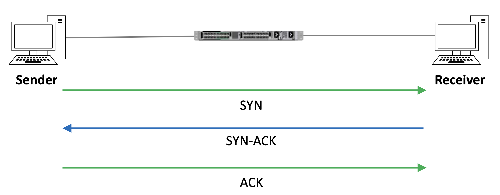
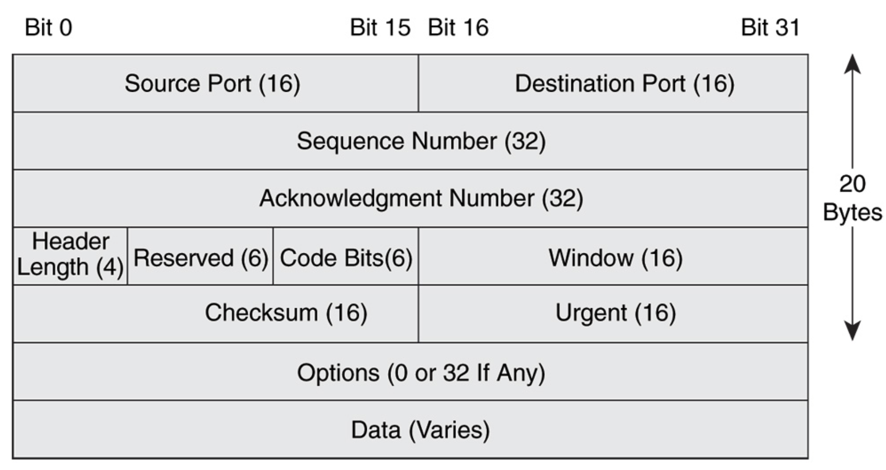
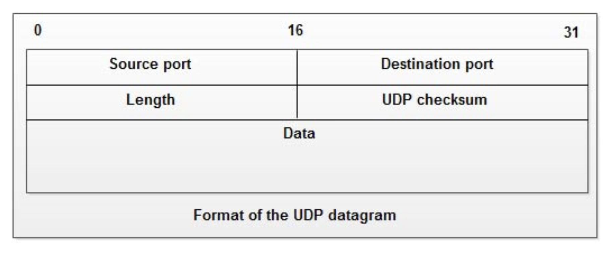
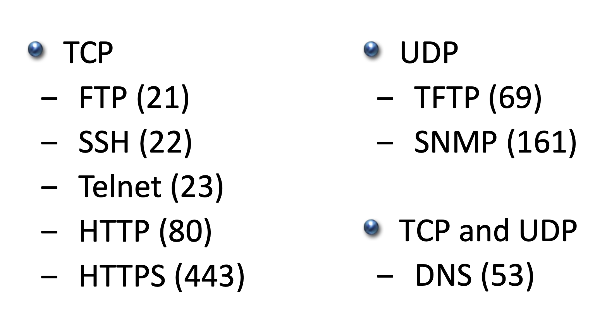

# Layer 4 - Transport Layer(전송계층)

## 개요

- 전송계층은 호스트 간의 데이터를 투명하게 전송하는 역할을 수행하며 종단 시스템간의 오류 복구와 흐름 제어를 담당한다.
- 흐름 제어는 수신 호스트가 데이터를 모두 처리할 수 있도록 발신자가 데이터 흐름을 조정하는 과정을 의미한다.
	- 예를들어 발신자의 인터넷 속도가 매우 높아서 너무 빠른 속도로 데이터를 전송하여 수신 호스트가 처리하기 벅찬 양을 보내는 경우, 흐름 제어가 작동해서 수신 호스트가 발신자에게 속도를 늦추도록 신호하는 메커니즘을 가질 수 있다.

## 세션 다중화

- 또한 전송계층은 세션 다중화를 지원하기도 한다.
- 세션 다중화란 호스트가 동시에 여러 세션을 지원하고 단일 링크에서 개별 트래픽 흐름을 관리할 수 있는 과정이다.
## 포트

- 4계층의 목적지 포트 번호는 상위계층 프로토콜이 어디있는 지 식별하기 위해서 사용한다.
	- 예를들어 HTTP는 80포트, SMTP 이메일은 25포트 처럼 말이다.
- 발신자는 또한 4계층 헤더에도 출발지 포트 번호를 추가한다.
- **출발지와 목적지 포트 번호를 조합하면 세션을 추적할 수 있다.**
## TCP

- **TCP(Transport Control Protocol)** & **UDP(User Datagram Protocol)** 는 4계층의 가장 일반적인 프로토콜이다.
- TCP는 **연결 기반 프로토콜**이다. 일단 연결이 이루어지면, 데이터는 해당 연결을 기반으로 두 호스트간 양방향으로 데이터를 전송한다.
- TCP는 **순서 제어**를 수행한다. 트래픽에 순서 번호를 포함하여 세그먼트가 옳은 순서대로 누락 없이 처리되도록 한다.
	- 트래픽이 수신자에게 도달하면 수신자는 순서 번호를 확인하고 올바른 순서로 트래픽을 조립할 수 있게 된다.
	- 또한 순서 번호로 확인할 수 있는 것은 전송 중 세그먼트의 누락 여부이다. 통신을 하다가 중간 순서 번호가 오지 않는다면 세그먼트가 누락되었다고 판단할 수 있다.
- TCP는 **신뢰할 수 있다.** 수신 호스트는 발신자에게 수취 통보를 보내고 순서 번호를 통해 수신자는 트래픽 전체가 들어왔는지 확인하고 전송 중 누락된 트래픽이 있다면 발신자에게 알릴 수 있다.
	- 발신자가 트래픽 누락을 인지하면 해당 트래픽을 다시 전송한다.
- TCP는 또한 **흐름제어도 수행**할 수 있다.
	- 발신자의 전송률이 너무 높아서 수신자가 처리할 수 없는 경우, 수신자는 발신자에게 속도를 늦추라는 신호를 보낼 수 있다.
### TCP Three-Way Handshake

- 두 개의 호스트 사이에 연결을 성립시키는 방법을 TCP 3단계 설정(TCP Three-Way Handshake)이라고 한다.
- 아래의 그림과 같은 방식으로 TCP Three-Way Handshake를 할 수 있다.

- 우선 왼쪽에 있는 발신자가 연결을 시작한다. 오른쪽 수신자를 향해 SYN, 즉 동기화된 메시지를 보낸다.
- 그걸 받은 수신자는 SYN-ACK, 즉 동기화 수취 통보를 전송하고, 마지막으로 연결을 완성 짓기 위해서 발신자가 ACK, 수취 통보를 한다.

### TCP Header

- TCP의 헤더에는 **출발지 및 목적지 포트번호**가 존재한다.
- 그 밖에도 순서번호, 응답번호(ACK Number), 데이터 등이 존재한다.

## UDP

- UDP는 사용자 데이터그램 프로토콜로써 **best effort** 방식으로 사용하여 트래픽을 전송한다.
- best effort란 프로토콜에 **연결이나 신뢰성 없이 발신자가 패킷을 구성해서 수신자에게 전송**하며 전송이 성공적이기를 바라는 것이다.
- 따라서 UCP는 연결 기반 프로토콜이 아니며 호스트간 아무 연결 설정이 없고 **순차제어를 수행하지 않는다.**
	- 세그먼트가 순서대로 누락 없이 처리될 지 확인이 불가능하니 신뢰할 수가 없는 것이다.
- 수신 호스트는 발신자에게 수취 통보를 보내지 않고 **흐름 제어 능력도 없다.**
- 트래픽의 오류를 발견하고 복구하는 방법이 존재하기는 하나, 이 경우에는 상위 계층에서 이루어져야 한다.
	- UDP 자체에서는 **오류 복구 기능이 존재하지 않는다.**

### UDP Header

- UDP 헤더에는 TCP 헤더와는 달리 필드가 많이 존재하지 않는다.
- 오직 **출발지 및 목적지 포트, 길이, UDP 체크섬, 데이터**만이 존재한다.
## TCP vs UDP

그렇다면 TCP와 UDP를 각기 어떤 상황에 사용하면 좋을까?

- 일반적으로 TCP는 신뢰성이 필요한 트래픽에 사용된다.
- 그러나 실시간 애플리케이션인 음성통화, 동영상 등의 애플리케이션은 TCP의 과도한 간접 비용을 감당할 수 없어서 UDP를 사용한다.
	- 또한 음성통화나 동영상은 응답 지연 시간에 매우 민감하다.
	- 따라서 응답속도가 빠른 실시간 처리에는 UDP를 사용하는 것이 적합하다.
- 요약하자면 **지연에 민감한 실시간 트래픽에는 보통 UDP를 사용하고, 그 이외의 것들은 TCP를 사용**한다.
- 하지만 몇몇 애플리케이션에는 TCP와 UDP 모두 사용할 수 있다.

- 위 그림을 보면 몇몇 일반적인 애플리케이션들과 이들의 목적지 포트가 명시되어있다.
- **TCP와 UDP를 모두 사용**하는 애플리케이션은 **DNS**로 53번 포트를 사용한다.