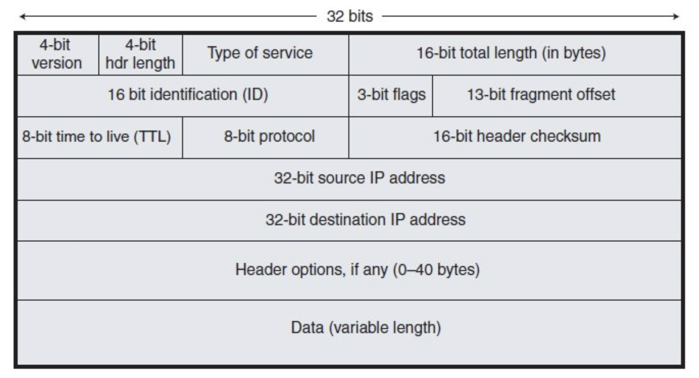

# Layer 3 - Network Layer(네트워크 계층)

## 개요

- 네트워크 계층은 **패킷을 네트워크상의 목적지로 라우팅**하는 역할을 수행하기에 **라우터**가 네트워크층에서 작동하게 된다.
	- 또한 서비스 품질도 담당하게 되는데, 서비스 품질이란 다른 레벨의 트래픽보다 더 나은 수준의 서비스를 필요로 하는 특정 유형의 트래픽이 있을 수 있다.
	- 예를들어 IP를 통해 음성 또는 영상을 실행한다면 지연에 민감하다. 따라서 이메일 같은 것보다 더 나은 품질의 서비스를 제공해야 한다.
- IP(Internet Protocol)은 가장 유명한 3계층의 프로토콜이다.
- IP는 **연결성**의 프로토콜이기 때문에 3계층에서는 응답이 존재하지 않는다.
	- 4계층에서 TCP 및 그 응답을 사용하거나 상위 계층에 내장하여 안정적인 트래픽을 유지할 수 있다.
- IP이외의 3계층 프로토콜에는 문제 해결을 위한 핑에 사용하는 ICMP(Internet Control Message Protocol)과 IPSec(보안 암호화 통신용)이 존재한다.

### IP Addressing

- IP 주소 지정은 3계층에 구현된 **논리적 주소 지정의 체계**이다.
- 네트워크 설계자는 IP 주소 지정을 사용해 전체 네트워크를 **서브넷**이라고 불리는 더 작은 하위 네트워크로 분할한다.
	- 이는 성능과 보안이 더 향상되고 문제 해결이 더 쉬워진다.
	- 하나의 큰 네트워크를 사용하는 대신 더 작은 서브넷으로 나눔으로써, **트래픽이 존재해야 할 특정 서브넷에만 트래픽이 일어나게끔 한다.**
	- 이런 방식으로는 트래픽이 전체적으로 퍼지지 않을 테니 **성능이 더욱 향상**된다.
- 논리적 주소 지정을 통해서는 **보안도 향상**시킬 수 있다.
	- 예를들어 회계 서버가 있다고 가정했을 때, 이를 하나의 특정 서브넷에 두면 누가 해당 서버에 액세스를 할 수 있을지를 쉽게 제어할 수 있다.
	- 또한 네트워크를 작은 부분으로 나누면 **문제가 발생할 시 네트워크의 어느 부분에 문제가 있는지 쉽게 확인이 가능**하고, 그 부분에만 집중할 수 있기 때문에 문제 해결도 용이해진다.
- 2계층은 이더넷을 사용하는 경우에 MAC 주소를 가지고 있다. 
	- IP주소는 3계층, MAC 주소는 2계층이다.
	- IP주소는 논리적 주소 지정 체계이고, MAC주소는 하나의 큰 전역 주소 지정 체계이다.
	- 2계층에는 논리적 분할이 없기 때문에 IP 주소 지정을 사용하여 3계층에서 수행된다.
### IP Header

- IP 헤더에는 우선 4-bit version 이 존재한다.
	- IPv4, IPv6 처럼 v4, v6 가 버전이 된다.
- 다음은 4-bit 헤더 길이가 존재한다.
- 다음은 서비스 바이트 유형이 있다.
	- 이는 서비스 품질 정보에 사용되는데, 패킷에 표시를 입력해 어떤 트래픽인지를 지정할 수 있으며, 나중에 라우터에서 이 표시를 기반으로 조치를 취해 더 나은 서비스를 제공할 수 있다.
- 또한 **출발지 IP 주소**와 패킷이 어디로 가는지를 지정하는 **목적지 IP주소**도 존재한다.
- 이 밖에 여러 속성들이 IP 헤더에 존재한다.

