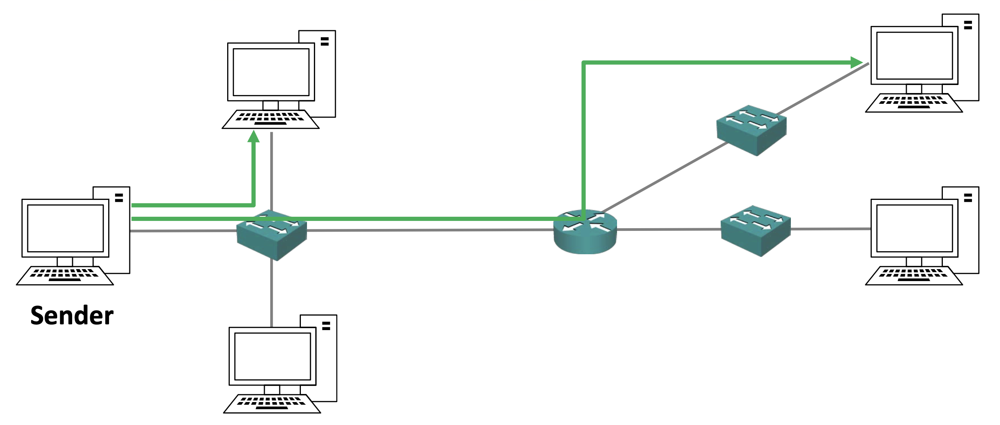
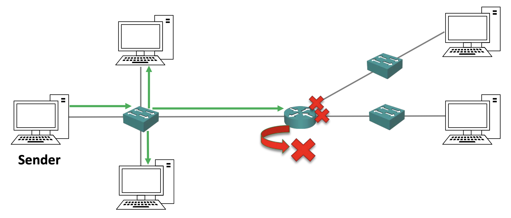
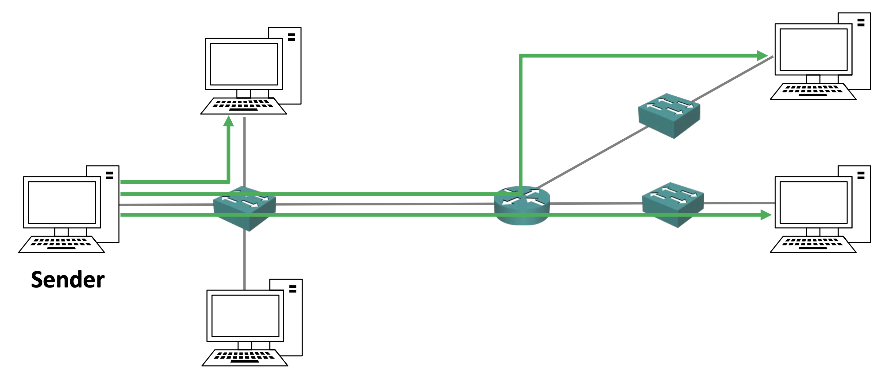
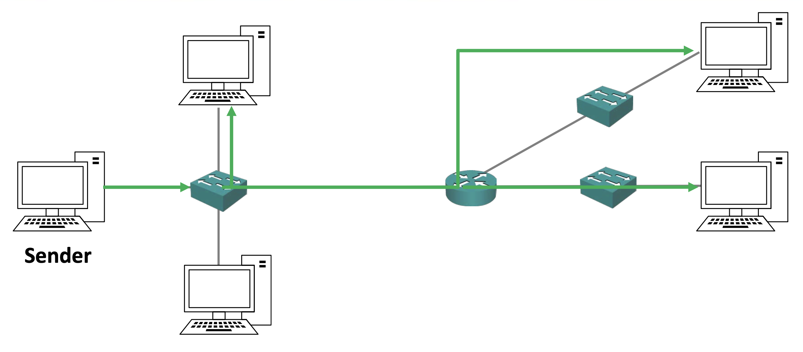

# Unicast, Broadcast and Multicast Traffic

- IP 트래픽의 유형으로는 유니캐스트, 브로드캐스트, 멀티캐스트의 세 가지 유형이 존재한다.
	- 유니캐스트: **단일 목적지**의 호스트로의 트래픽
	- 브로드캐스트: **서브넷안의 모든 호스트**로의 트래픽
	- 멀티캐스트: **원하는 여러 개의 호스트**로의 트래픽

## Unicast Traffic

- 왼쪽에 발신자가 존재하고 이 발신자가 특정 트래픽을 특정 PC, 즉 **단일 호스트**로 트래픽을 보내는 것을 의미한다.
- 유니캐스트 트래픽은 단일 호스트로 보내지기 때문에, '**Uni**' cast 라고 불린다.

## Broadbast Traffic

- 브로드캐스트 트래픽의 경우 발신자가 스위치로 들어오는 트래픽의 복사본 하나를 보내게 되면, **해당 네트워크 부분에 있는 다른 모든 호스트에게로 트래픽이 흘러 들어간다.**
- 그림을 보면 중간에 있는 라우터로도 트래픽이 전송되는게 보인다.
	- 만약 라우터가 네트워크에 인터페이스를 보유하고 있다면 위 그림처럼 라우터가 트래픽을 삭제해서 그 뒤로는 브로드캐스트 트래픽을 전달하지 않는다.
	- 만약 인터넷에서 브로드캐스트 트래픽을 보냈는데, 인터넷의 모든 사람에게 전송된다고 생각해보면 이는 당연하다.
	- 많은 브로드캐스트 트래픽이 있으므로 이렇게 된다면 성능에 악영향을 끼칠 뿐만아니라 보안 문제도 생길 수 있다.
- 요약하면 브로드캐스트 트래픽은 하나의 복사본이 **네트워크의 특정 부분 내 전체에 흘러드는 것**을 의미한다.

## Unicast Traffic to Multiple Hosts

- 유니캐스트 트래픽이 다수의 호스트에 작용하는 방식을 살펴보자.
- 좌측에 발신자가 영상 트래픽을 스트리밍한다고 가정해보자.
	- 트래픽의 대역폭은 개당 1MB라고 가정한다.
- 발신자는 상단의 PC, 맨 우측 상단의 PC, 그리고 동일한 트래픽의 별도 복사본을 개별 호스트 각각에 보낸다.
- 이렇게 보내면 위 그림에서는 좌측의 호스트에겐 3MB의 대역폭의 트래픽이 가해진다.
- 목적지 호스트가 많아질수록 대역폭이 커진다는 문제가 생긴다.
- 이에 따라서 멀티캐스트라는 개념이 등장한다.

## Multicast Traffic

- 멀티캐스트를 사용하면 **하나의 사본을 여러 다양한 목적지로 보낸다.**
- 발신자는 동일한 영상 스트림의 **사본 하나**를 보내고, **그 하나의 사본은 관심있는 모든 수신자들에게 전송**된다.
- 즉, 트래픽을 받을 수신자가 3개여도 3MB가 아닌 1MB의 대역폭의 트래픽만 보낸다는 뜻이다.
- 브로드캐스트 트래픽과 멀티캐스트 트래픽의 차이점은 브로드캐스트 트래픽은 수신자의 요청 여부와 무관하게 네트워크의 특정 부분의 모든 곳으로 전달되는 반면에 멀티캐스트 트래픽은 수신자가 먼저 요청을 해야만 트래픽이 전달된다는 것이다.
	- 예를들어 어떤 사람이 특정 라디로 방송을 들으려면 특정 라디오 방송에 대한 주파수를 맞춰야 한다는 것이다.

