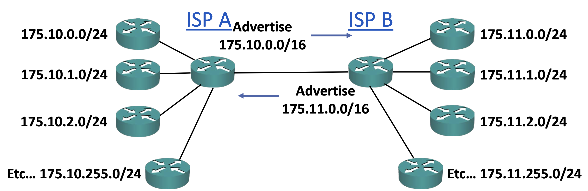

# CIDR Classless Inter-Domain Routing

클래스로 구분된 주소 방식이 가진 문제점은 인터넷 승인 기관이 주소를 배정할 때 항상 /8 서브넷 마스크의 Class A 전체, /16 서브넷 마스크의 Class B 전체, /24 서브넷 마스크의 Class C 전체를 배정한다는 점이다.

만약 한 회사가 254개가 넘는 호스트를 가지고 있는 경우에는 Class C로는 부족하기 때문에 Class B를 배정해야 한다. 만약 그 회사의 호스트 숫자가 500개인 경우 실제 할당되는 호스트 주소는 65534개가 되어 너무 많은 주소가 배정되게 된다. 이는 글로벌 주소 공간에 엄청난 낭비를 초래하게 되는 것이다.

이런 문제에 대한 해결책 또는 부분적인 해결책으로서 CIDR(Classes Inter-Domain Routing)이 도입되었다.

CIDR은 주소 클래스들에게 요구되었던 /8, /16, /24로 고정된 서브넷 마스크 요구사항을 없앴다. 그리고 이들을 여러 작은 네트워크로 분할 할 수 있도록 하였다. 이를 서브네팅(Subnetting)이라고 부른다. 예를들어 인터넷 승인 기관들은 175.10.10.0/20 과 같은 주소를 배정할 수 있게 되었다. 첫 번째 옥텟이 175 이므로 Class B 주소라는 것을 인지할 수 있다.

통상적으로 Class B 주소의 서브넷 마스크는 /16인데 서브네팅하여 /20을 할당함으로써 175 범위 내의 다른 네트워크들을 다른 회사들에 배정할 수 있게 되었다. 이렇게 과하게 큰 범위를 배정하는 대신에 클래스를 더 작은 네트워크로 분할하여 여러 조직에 분배할 수 있다. 즉, 낭비되는 주소가 적어졌다는 의미이다.
## CIDR and Route Summarisation

CIDR의 또 다른 장점은 경로 요약이다. 아래의 그림을 보자.

ISP A 라우터가 존재하고, 이들은 좌측에 보이는 주소 블록들을 배정했다. 한 회사는 175.10.0.0/24를 배정받고, 다음은 175.10.1.0/24, 175.10.2.0/24 ... 175.10.255.0/24 까지 배정하였다. 결과적으로 256개의 주소 블록을 배정한 것이다.

우측에는 ISP B 라우터가 존재하고, 이들은 우측에 보이는 주소 블록들을 배정했다. 175.11.0.0/24 - 175.11.255.0/24 까지 256개의 주소 블록을 배정한 것이다.

그리고 ISP A와 ISP B가 연결된다. 만약 CIDR이 없다면 경로 요약이 불가능하다. CIDR이 없다면 ISP A는 256개의 주소 블록 모두를 ISP B에 통지하고, ISP B는 256개의 주소 블록 모두를 ISP A에 통지해야 한다. 하지만 CIDR과 경로 요약이 존재한다면 두 ISP들이 합계 블록만 서로에게 통지하면 된다.

따라서 ISP A는 256개의 /24를 통지하는 대신에 256개의 소형 네트워크 전체의 상위 집합인 175.10.0.0/16만 통지하고, ISP B도 동일하게 통지하면 된다. 이제 ISP B는 ISP A에 속한 모든 네트워크 256개가 아니라, 이를 모두 요약한 오직 한 가지 경로만 통지를 받게된다. ISP A도 마찬가지이다.
## Route Summarisation Benefits

- ISP A는 ISP B에 속한 256개 네트워크에 대해 모른다.
- ISP A는 오직 ISP B 전체를 아우르는 요약 경로 하나만 알게된다.
- 이러한 경로요약은 ISP A의 라우팅 테이블의 크기를 줄이고, 이에 따라 메모리 사용량도 감소시켜준다.
- 만약 ISP B의 네트워크 중 하나의 네트워크가 다운된다고 해도, 경로 요약에는 변화가 없기 때문에 ISP A에 영향을 주지 않는다.
	- 단, ISP B는 경로들 중 하나가 다운될 때마다 다른 라우터들이 다시 계산을 해야한다.
- 이 방식의 장점은, 네트워크의 여러 부분에 대해 구획을 나눔으로써 A 부분에 문제가 생기더라도 B 부분에는 영향이 가지 않는다는 점이다.