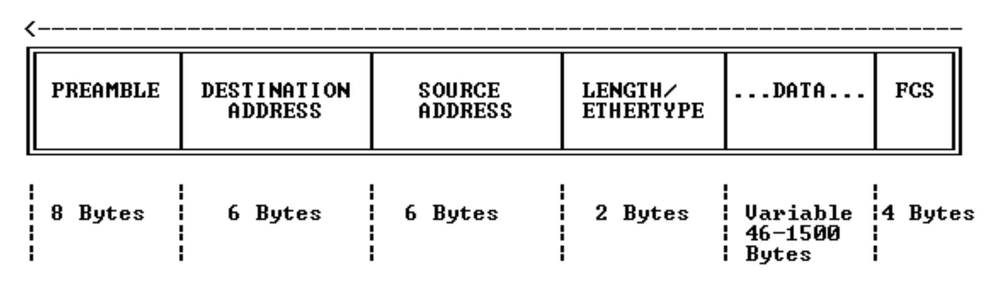

# Local Area Network Layer 2 - Ethernet

## Layer 2 - The Data Link Layer

2계층에서 **프레임은 비트로 인코딩 및 디코딩**되어 물리층, 즉 물리적 회선에 배치될 준비가 된다. 사용 중인 프로토콜에 따라 물리층에 대한 오류 감지 및 수정이 여기에서 제공될 수 있다. 

**이더넷(Ethernet)** 은 로컬 영역 네트워크(LAN)에서 사용되는 2계층 매체이다.
## Ethernet Header

이더넷 헤더에는 다음과 같은 정보가 포함된다. 헤더의 시작 부분에 서문(Preamble)이 존재한다. 이는 발신자와 수신자가 동기화되도록 돕는 데 사용된다. 그리고 2계층의 **출발지와 목적지 주소**가 있는데, 이는 이더넷을 사용할 때의 **MAC 주소**이다. 그리고 Ethertype이라는 것이 존재하는데, 이는 이더넷 헤더 내부에 캡슐화되는 항목을 지정하는 데 사용되므로 보통 IPv4가 된다. 마지막으로 데이터와 FCS(Frame Check Sequence)가 존재한다.
## Media Access Control MAC Address

- MAC은 **Media Access Control**의 약자로 MAC 주소는 **48비트 16진수**이다.
- MAC 주소는 MAC 주소를 구성하는 요소와 관련해서 반으로 쪼개질 수 있다.
	- **첫 24비트는 OUI**이다. 이는 Organizationally Unique Identifier의 약자로 이더넷 포트의 제조업체를 나타내는 부분이다.
	- **마지막 24비트는 제조업체**에 의해 지정이 된다. 세상 모든 NIC포트에 새겨진 MAC 주소는 전 세계적으로 고유하다.
- 마지막으로 MAC 주소는 **논리적 주소 지정이 존재하지 않는다.** 단지 **하나의 큰 평면 주소 공간**일 뿐이다. 
	- 예를들어 IBM의 네트워크 카드가 있는 PC가 있다면 IBM MAC 주소가 있을 것이다. 이는 뉴욕에서 온 것 일수도 있고, 베이징이나 런던에 있는 IBM에서 온 네트워크 카드일 수도 있을 것이다. 하지만 이들은 함께 그룹화되지 않는데, 그 이유는 MAC 주소에는 논리적인 순서가 없기 때문이다. 그냥 하나의 큰 평면 주소공간일 뿐이다.
