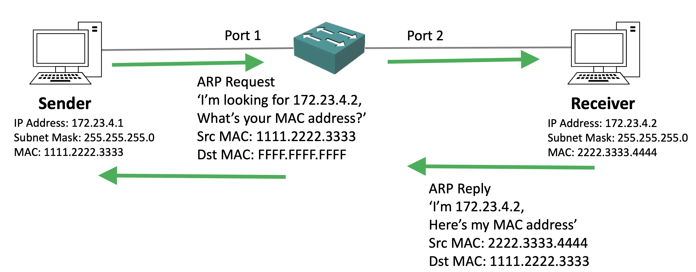
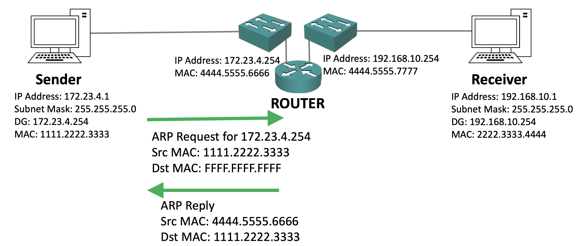
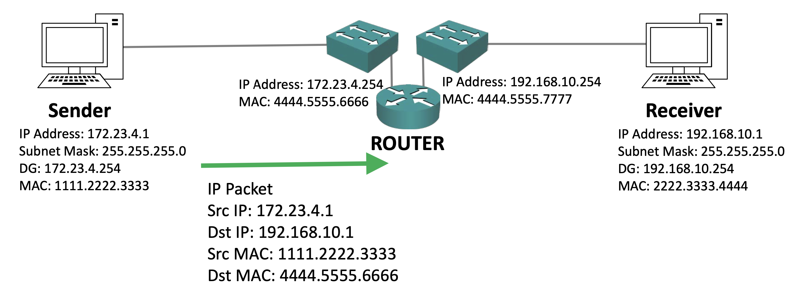
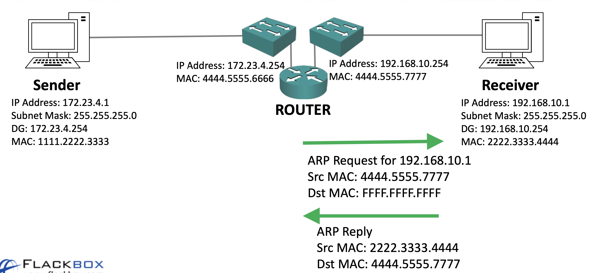
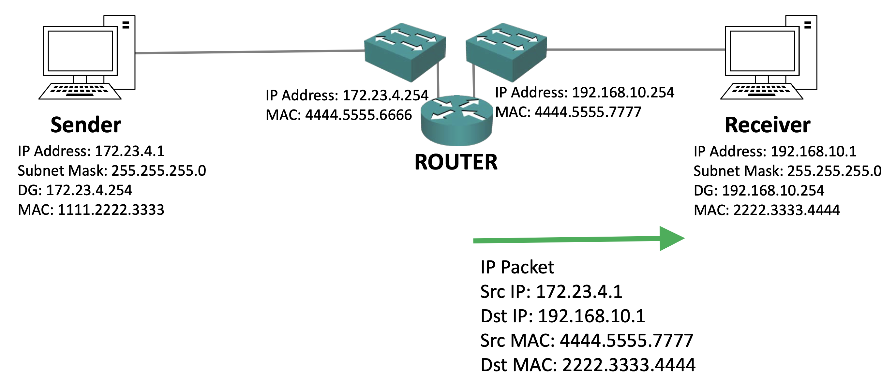

# ARP - Address Resolution Protocol
## IP to MAC Address Resolution

발신자는 IP주소로 바로 보낼 수 있고 FQDN으로 보낼 수도 있는데, 전체 주소 도메인 이름인 FQDN으로 보내는 경우에는 DNS를 이용하는 IP주소로 변환되어야 한다. 따라서 목적지의 IP주소를 찾은 뒤 패킷이 2계층까지 내려오면 발신자는 목적지의 MAC주소 또한 알고있어야 한다. 이 때문에 발신자가 패킷을 구성할 때 목적지 IP주소와 MAC 주소 모두를 알아야한다.

IP 주소는 관리자에 의해 제어되는 논리적 주소이다. 따라서 애플리케이션에는 목적지의 직접적인 IP 주소나 DNS가 변환할 수 있는 FQDN이 표시되어 있어야 할 것이다. 하지만 MAC 주소는 논리적 주소가 아니다. 그저 매우 거대한 전역 주소 공간이 있을 뿐이다. 따라서 유저가 직접 목적지의 MAC 주소를 입력하거나, 또는 자동으로 변환해야한다. 이는 애플리케이션 내에 설정하는 것은 거의 불가능하기 때문이다. 

이 때문에 자동으로 MAC 주소를 찾기 위한 방법이 필요하다. MAC 주소를 자동으로 찾아낼 프로토콜이 필요한 것이다. 그리고 주소 결정 프로토콜인 ARP가 바로 그 역할을 하는 것이다. ARP는 목적지의 IP 주소를 이용하여 목적지의 MAC주소를 찾아낸다.

### ARP - Same Subnet

두 호스트 모두가 **동일한 IP 서브넷에 속한 경우의 ARP의 동작 원리**를 알아보자.

발신자가  IP주소가 172.23.4.2인 목적지의 MAC 주소를 찾고있다고 가정해보자. 그럼 이 ARP 요청은 발신자의 MAC 주소인 1.2.3에서 목적지 MAC주소인 F.F.F로 간다. 이것이 바로 2계층의 **브로드캐스트 주소**이다. 이는 왜냐하면 목적지의 MAC 주소를 모르기 때문에 모든 곳으로 요청을 보내야하기 때문이다.

그럼 요청이 스위치로 전달이 될 것이다. 스위치는 브로드캐스트 트래픽임을 확인하고 모든 포트로 전송을 하게된다. 스위치와 연결된 모든 포트, 즉 이 경우엔 우측의 수신자에게도 전송을 할 것이다. 그럼 우측의 있는 수신자가 ARP 요청을 처리하게 된다. 수신자는 요청된 주소가 172.23.4.2임을 확인하고 나서 그 주소가 자신의 IP 주소임을 인지해 ARP 요청에 응답할 것이다.

그 주소가 자신의 IP 주소임을 인지해 ARP 요청에 응답을 할 것이고, MAC 주소를 포함해서 말이다. 그리고 이 회신은 MAC 주소 2.3.4를 출발지로 해서 전송이 되고 이 경우의 목적지 MAC 주소는 기존의 발신자의 유니캐스트 MAC 주소인 1.2.3이 될 것이다. 수신자는 정확히 어디로 회신을 보내야 할지를 알고 있을 것이다. 이는 왜냐하면 발신자의 MAC주소인 1.2.3이 ARP 요청에 포함되어 있었기 때문이다.

스위치는 이 ARP 회신을 1번 포트를 통해서 최초 발신자에게로 보낼 것이다. ARP는 캐시가 되기 때문에 통신을 위해 매번 ARP 요청을 보낼 필요가 없다.

### ARP - Different Subnet

그렇다면 두 호스트 모두가 **다른 IP 서브넷에 속한 경우의 ARP의 동작 원리**를 알아보자.

두 호스트는 다른 서브넷 사이에 위치하기 때문에 라우터를 통해서 연결해야한다는 점을 알고있을 것이다. 따라서 발신자는 기본 게이트웨이인 172.23.4.254에 ARP 요청을 보낸다. 이 요청은 출발지 MAC 주소인 1.2.3에서 전송이 되고 목적지 MAC 주소는 ARP 요청에서와 늘 그렇듯 F.F.F이며 2계층의 브로드캐스트 주소이다. 또한 이 ARP 요청으로 172.23.4.254의 MAC주소 또한 물어볼 것이다. 해당 요청은 라우터를 포함한 172.23.4.0 서브넷 전체로 전송이 된다. 라우터는 자신에게로 ARP 요청이 온 것을 확인하고 ARP 회신을 보낼 것이고, 이 회신은 IP주소 172.23.4.254의 MAC 주소인 4.5.6을 출발지로 해서 전송이 되며 목적지의 MAC 주소는 1.2.3이 될 것이다.

기존의 ARP 요청이 들어오는 동안 라우터는 최종 목적지로 전송되어야 하는 IP 패킷을 보관하고 있게 된다. 요청을 통해 목적지의 MAC 주소를 알게되고 나면 라우터가 IP 패킷을 전송하게 된다. IP 패킷은 발신자의 출발지 IP 주소인 172.23.4.1로부터 올 것이고, 목적지의 IP 주소는 최종 목적지의 IP 주소가 될 것이니 192.168.10.1 일 것이고, 출발지의 MAC 추소는 1.2.3 그리고 목적지의 MAC 주소는 발신자의 기본 게이트웨이인 4.5.6이다.

이 패킷이 라우터에 도달하면 라우터는 192.168.10.1로 보내야 한다는 것을 인지한다. 하지만 라우터는 192.168.10.1의 MAC주소를 모른다. 아직은 192.168.10.1과 라우터가 소통을한 적이 없기 때문에 ARP 캐시가 되어있지 않기 때문이다. 따라서 라우터는 왼쪽의 발신자가 보낸 IP 패킷을 보관한 채로 192.168.10.1 주소로 ARP 요청을 보낼 것이다. 이 요청은 192.168.10.254의 IP 주소를 가진 우측의 인터페이스를 통해 전달된다.

라우터는 192.168.10.1로 향하는 ARP요청임을 알리고 이 요청이 라우터의 IP 주소 192.168.10.254인 출발지 MAC 주소인 4.5.6에서 전송되었다는 것을 알려주게 된다. 이는 ARP 요청이니 이 요청은 2계층 브로드캐스트의 MAC 주소인 F.F.F로 도달한다. 그리고 이 요청은 우측의 있는 수신자를 포함한 192.168.10 서브넷 전체로 퍼져나가게된다.

우측의 수신자는 이 요청이 자신의 IP 주소인 192.168.10.1로 온 ARP 요청임을 확인하고 ARP 회신을 보낼것이다. ARP 회신인 MAC 주소 2.3.4를 출발지로 하고 라우터의 인터페이스 MAC 주소인, 우측의 인터페이스 MAC 주소 4.5.7을 목적지로 해 전송이 된다. 이렇게 해서 라우터는 우측에 있는 최종 목적지의 MAC 주소를 알게되는 것이다.

이제 ARP 요청을 한 번 수행했으니 라우터는 ARP 캐시가 되어서 IP주소가 192.168.10.1 인 MAC주소를 알고 있어서 다음 요청시에는 다시 요청하지 않을 것이다.
