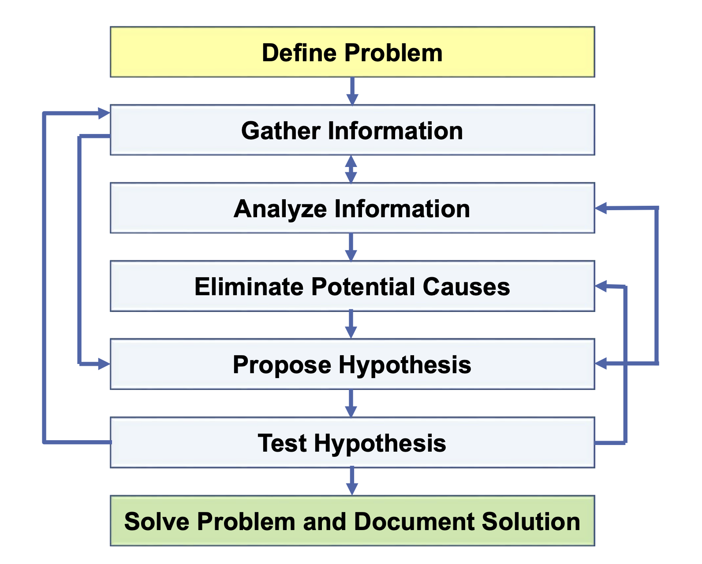

# The Cisco Troubleshooting Methodology

1. 문제가 정확히 무엇인지 파악
2. 문제에 대한 정보 수집
	- 예를들어 연결에 대한 문제가 생겼다고 가정해보자. 먼저 출발지에서 목적지까지 핑이 가능한 지를 확인해 볼 것이다.
	- 만약 불가능하다면 한 호스트에만 문제가 있는 것인지, 아니면 동일 구역의 다른 호스트에게도 문제가 발생한 것인지를 확인해야할 것이다.
	- 만약 한 호스트에만 문제가 발생한다면 해당 호스트 문제일 가능성이 높을 것이다.
3. 획득한 정보를 분석
	- 사람들에게 질문을 하는 것 뿐만아니라 장치에서 show 및 debug 명령어를 사용해 의문을 제기하고, 정보를 획득해야 한다.
	- 그 후 정보를 분석하여 문제의 원인에 대한 단서를 찾아야한다.
4. 잠재적인 원인을 제거
	- 예를들어 출발지에서 목적지까지 연결 상태의 문제를 해결하는 경우 출발지에서 목적지 사이에 여러 개의 라우터가 있을 때 문제해결을 위해 먼저 첫 번째 홉 라우터를 점검하고, 설정에 문제가 없다면 가능한 원인에서 이를 소거한 후 경로 상의 다음 홉 라우터를 점검하는 것이다.
5. 가설을 제시
	- 획득한 모든 정보를 고려하여 문제의 원인으로 가장 가능성이 높은 것을 파악한다.
6. 그 후 가설을 검증하기 위해 명령어를 입력하거나, 해당 문제를 해결하기 위한 행동을 취한다.
7. 만약 이렇게 해서 문제가 해결되었다면 상황이 종료되고 맨 하단의 단계로 내려온다. 해결 방법을 기록하는 것이다.
## Troubleshooting Methods

문제해결 방법은 경험이 제일 중요하다. 때로는 탑다운 방식으로 접근하는 것이 좋고, 때로는 바텀업 방식이나 분할 정복 방식이 맞을 수도 있다.

일부 문제는 응용층에서 시작해서 아래쪽의 계층으로 내려가며 문제를 해결하는 것이 논리적으로 타당하지만, 올라가면서 문제를 해결하는 게 더 쉽기도 하다. 그리고 때로는 분할 정복 방식을 쓸 수도 있는데, 예를들면 연결 상태에 문제가 발생했을 때, 그 문제가 항상 네트워크층에서 발생했다면 거기서부터 문제 해결을 시작할 수도 있다. 문제에 따라서 OSI 스택 위나 아래쪽으로 진행하는 것이다.

다음은 문제해결에 적용할 수 있는 방법들이다.

- 설정을 비교해라
	- 만약 조직에 속해있다면 대체로 라우터와 스위치를 설정하는 템플릿을 사용하게 될 것이다.
	- 기존의 조직에서는 이미 기존의 라우터와 스위치가 있기 때문에 처음부터 새로 설정하는 것보다는 템플릿에 기반하여 설정하게 되는 것이다.
	- 만약 그런 상황에서 문제가 발생했고, 특정 라우터에서 문제가 발생한 것으로 판단이 되는 경우에 비슷하게 설정되어 있을 다른 라우터와 비교하여 차이점을 확인해볼 수 있을 것이다.
- 경로를 추적해라
	- 연결성 문제를 해결하는데 있어서는 주로 경로를 추적한다.
	- 연결성 문제를 해결하고 경로를 추적하는데 있어서 최고의 방법은 출발지에서 시작하여 목적지를 향해 가는 것이다.
- 부품을 교체해라
	- 만약 특정 장치에 문제가 있는 것을 파악했는데, 설정상 오류가 전혀 없을 때는 정상적으로 작동하는 하드웨어와 교체해 문제를 확인할 수 있다.
	- 물리적인 수준에서의 문제거나 뭔가 깜빡했을 수 있을 것이다.
	- 예를들어 케이블이 있는데, 모든 설정이 잘 되어있어서 케이블의 문제라고 판단되는 경우, 즉 케이블을 교체해서 문제가 해결되는지 확인해 보는 것이다.

연결성 문제를 해결할 때 자주 쓰이는 명령어가 대표적으로 세 가지 존재한다.

- Ping
	- 두 기기 사이의 연결성을 점검할 수 있다.
	- 핑을 내보낼 때, 이는 ICMP를 사용하여 패킷을 출발지에서 목적지로 보낸다. 그러면 목적지에서 핑에 대한 회신을 보낼 것이다.
	- 이렇게 핑으로 **양방향 연결성**을 확인할 수 있다.
	- 만약 출발지에서 목적지까지 연결성이 확보되어 있는데, 목적지에서 출발지로 돌아오는 경로에 문제가 있다면, 핑이 작동하지 않을 것이다.
- Traceroute
	- ping에 실패했을 경우 사용할 명령어이다.
	- 만약 출발지와 목적지 사이에 여러 개의 라우터가 있다면 출발지에서 목적지까지 하나하나 짚어가며 문제를 해결할 수 있다. 만약 라우터 R1, R2, R3 그리고 R4가 있다고 가정할 때 R1을 먼저 점검하고 문제가 없으면 R2, R3로 쭉 계속 진행하는 것이다. traceroute가 이 과정을 빠르게 만들어 준다.
	- traceroute가 **홉마다 통과하는 핑을 출발지에서 목적지까지 보내면 대체로 어떤 라우터에 문제가 있는지를 특정할 수 있다.**
- Telnet
	- 마지막으로 telnet을 이용하는 것이다. telnet은 일반적으로 라우터나 스위치와 같은 네트워크 인프라 장치를 관리하는 데 사용된다.
	- telnet을 통해 **기기의 CLI로 접근할 수 있다.**
	- 또 다른 용도로는 **port가 특정 목적지에 대해 열려있는지 확인**을 해준다. 기본으로 설정된 23번 포트에 telnet을 쓰는 대신 80번 포트에 telnet을 사용할 수 있다. 이를 통해 80번 포트가 열려있는지의 여부와 목적지와 의사소통이 가능한지의 여부를 확인할 수 있다.
