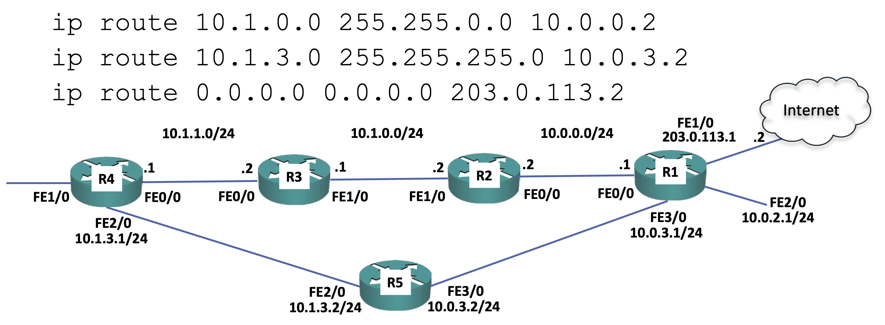

# 요약 경로 및 Longest Prefix Match

### 요약 경로

- 여러 라우팅 경로를 하나의 경로로 요약하는 것을 의미한다.
- 이렇게 여러 개의 라우팅 경로를 요약 경로로 줄이면 관리자 오버헤드가 줄어든다.
- 또한 라우팅 테이블에 적을 경로가 줄어들기 때문에 메모리 사용량을 줄여준다.

다음 명령어는 세 가지의 라우팅 경로를 추가하는 예시이다.
```shell
ip route 10.1.0.0 255.255.255.0 10.0.0.2
ip route 10.1.1.0 255.255.255.0 10.0.0.2
ip route 10.1.2.0 255.255.255.0 10.0.0.2
```

위 라우팅 경로를 다음과 같이 요약 경로를 이용해서 하나의 요약 경로로 표현할 수 있다.
```shell
ip route 10.1.0.0 255.255.0.0 10.0.0.2
```
- 위 요약 경로는 10.1.0.0 ~ 10.1.255.0 까지의 경로를 모두 포함한다.
- 하지만 이런 서브넷이 모두 필요한 것은 아니다.
- 따라서 다음과 같이 조금 더 빽빽한 요약 경로를 이용해도 무관하다.
```shell
ip route 10.1.0.0 255.255.252.0 10.0.0.2
```
- 위 요약 경로는 10.1.0.0 ~ 10.1.3.0 까지의 경로를 모두 포함한다.
- 따라서 우리가 원하는 10.1.0.0, 10.1.1.0, 10.1.2.0 을 포함할 수 있다.
### Longest Prefix Match

- 만약 라우팅 경로가 겹친다면 더 긴 prefix가 선택된다.
- 다음과 같은 두 가지의 경로를 보자.
```shell
ip route 10.1.0.0 255.255.0.0 10.0.0.2
ip route 10.1.3.0 255.255.255.0 10.0.3.2
```
- 만약 위 두 개의 라우팅 경로에 모두 겹친다면 더 긴 prefix(255.255.255.0)인 아래의 라우팅 경로를 선택하여 라우팅된다.
- 만약 접두어까지 같은 경우라면 어떻게 라우팅 경로를 선택할까?
	- 이 경우, 라우터는 이 경로들에 대해 트래픽 부하 균형을 맞출 것이다.
### Default Route(Gateway of Last Resort)

```shell
ip route 10.1.0.0 255.255.0.0 10.0.0.2
ip route 10.1.3.0 255.255.255.0 10.0.3.2
```
- sh ip route 명령어를 사용하면 마지막 수단의 게이트웨이가 표시된다.
- 다음 그림에서 R1은 공공 IP주소인 203.0.113.1을 사용한다고 하고 인터넷 서비스 제공자 측의 IP주소는 203.0.113.2라고 가정해보자.

- 이렇게 구체적으로 경로를 지정한 적이 없었던 곳으로 향하는 경로를 추가하기 위해서는 다음과 같이 추가한다.
```shell
ip route 0.0.0.0 0.0.0.0 203.0.113.2
```
- 따라서 우리가 지정한 경로에 일치하지 않는 모든 트래픽은 이 기본 경로를 사용하게 된다.
- 예를들어 우리가 트래픽을 10.1.1 네트워크로 보낸다면 이는 첫 번째 라우팅 경로와 일치하고, 또한 0.0.0.0으로 가는 어디든 갈 수 있는 마지막 경로와도 일치한다. 하지만 상단 경로가 더 구체적이니 해당 트래픽은 10.0.0.2의 R2로 보내질 것이다.
- 만약 트래픽을 10.1.3 네트워크로 보낸다면 세 경로 모두와 일치한다. 하지만 두 번째 경로가 더 구체적이니 10.0.3.2의 R5로 전송이 될 것이다.
- 만약 트래픽을 50.50.50.50의 인터넷으로 보낸다면 마지막 경로에만 일치를 하고 이 경로를 통해서 인터넷으로 전송될 것이다.
