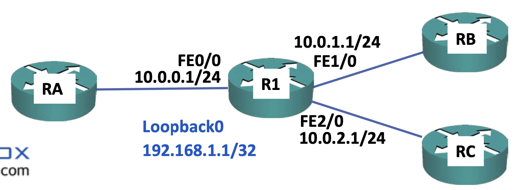

# Adjacencies

- IGP 라우팅 프로토콜은 글로벌 구성 내에 구성되고, 그 후 라우터의 라우팅 프로토콜이 인터페이스에서 활성화되면 라우터는 직접 연결된 링크 상의 다른 장치들을 탐색하게 되며 다른 장치들 또한 라우팅 프로토콜을 실행해 서로 대등 접속을 하게된다.
- 라우터는 해당 특정 라우팅 프로토콜에 대한 Hello 패킷을 전송하고 수신 대기를 하게 된다.
	- 그러다가 일치하는 대등 라우터를 발견하게 되면 라우터들은 인접성을 형성해 서로 라우팅 업데이트를 교환한다.
- 현대 라우팅 프로토콜은 Hello 패킷으로 **멀티캐스트**를 사용한다.
	- 멀티캐스트는 RIP 버전 1과 같은 초기 프로토콜에서 사용되었던 브로드캐스트보다 효율적이다.
	- 멀티캐스트는 한 라우팅 프로토콜로만 특정이 된다.
	- 해당 라우팅 프로토콜과의 **인접성 형성에 관심이 있는 장치만이 해당 패킷을 처리**하는 것이다.
	- 따라서 모든 호스트에 의해 처리되어야 하는 브로드캐스트 트래픽과 다르게 더욱 효율적이다.
## Adjacency Example

- 라우팅 프로토콜이 활성화되고 인터페이스 상에 구성된 IP 서브넷은 당연히 라우팅 프로토콜 업데이트에 포함될 것이다.
- 비록 R1은 Loopback0, FastEthernet0/0, FastEthernet1/0에서는 라우팅 프로토콜이 활성화 되었으나, FastEthernet2/0에서는 라우팅 프로토콜이 활성화되지 않았다.
- 이렇게 구성된 이유는 협렵 조직에 속한 라우터 RC와의 연결은 필요하지만 해당 라우터로 내부 정보를 보내서는 안되기 때문이다.
	- 그렇지 않다면 보안상의 문제가 생길 것이다.
- R1은 Loopback0, FastEthernet0/0, FastEthernet1/0 인터페이스에서 Hello 패킷을 송출하고 수신 대기를 할 것이다. 이는 이들이 라우팅 프로토콜이 활성화된 인터페이스이기 때문이다.
- 그리고 해당 링크에서 찾은 동일한 라우팅 프로토콜을 실행하는 라우터들과 인접성을 형성할 것이다.
- 이 예시의 경우에는 R1을 향하고 있는 인터페이스인 RA와 RB에서도 라우팅 프로토콜을 활성화했기 때문에 이 라우터들은 Hello 패킷을 통해 서로를 탐색하게 되며 이후 인접성을 형성하고 라우팅 업데이트를 공유할 것이다.
	- 하지만 R1의 FastEthernet2/0에서는 Hello 패킷을 전송하거나 수신 대기하지 않을 것이다. 이는 해당 인터페이스에 라우팅 프로토콜을 활성화하지 않았기 때문이다.
	- 따라서 이 인터페이스는 RC와 인접성을 형성하지 않을 것이고 RC로 네트워크 정보를 발송하지 않을 것이다.
	- 이 예시에서는 RC가 협력사이므로 연결은 가능해야 하지만, 내부 정보를 전송하진 않을 것이다.
	- 이런 경우 아주 제한적인 연결성을 위해 정적 경로를 사용할 수 있다.
- R1은 RA, RB와 인접성을 형성했기 때문에 이들에게 IP 서브넷을 통보할 것이다.
	- 10.0.0.0/24, 10.0.1.0/24, 192.168.1.1/32 를 통보할 것이다.
	- 하지만 10.0.2.0/24는 통보하지 않을 것인데, 이 인터페이스는 라우팅 프로토콜에 포함되지 않았기 때문이다.
	- 글로벌 구성에서 라우팅 프로토콜을 활성화한 뒤 인터페이스에서 활성화를 하면 라우터는 Hello 패킷을 전송해 해당 인터페이스와 인접성을 형성하려 할 것이며, 그 인터페이스에 있는 서브넷 또한 통보할 것이다.
	- 하지만 인터페이스가 라우팅 프로토콜에 포함되지 않은 경우에는 라우터는 해당 인터페이스로 Hello 패킷을 전송하지 않을 것이며, 해당 링크에 구성된 서브넷은 다른 라우터들에 통보하지도 않을 것이다.
	- 따라서 RC로 정보를 보내지 않을 것이며, 10.0.2.0/24로 향하는 경로는 라우팅 프로토콜에 포함되지 않았으므로 RA와 RB는 이 경로를 학습하지 않을 것이다.
## Passive Interfaces

하지만 위의 예시에서 RA와 RB가 10.0.2.0/24로 가는 경로를 학습해야 하는 상황이라면 어떻게 해야할까?
이런 경우에 **수동 인터페이스**를 사용한다. 수동 인터페이스를 사용하면 **해당 인터페이스를 통해서 업데이트를 보내지 않으면서도 라우팅 프로토콜 내에 IP 서브넷을 포함시킬 수 있다.** 

여기에서 만약 FastEthernet2/0이 수동 인터페이스로 구성된다면 **RA와 RB는 10.0.2.0으로 가는 경로를 학습하겠지만**, **내부 네트워크 정보는 RC로 전송이 되지 않을 것이다.**

**루프백 인터페이스는 항상 수동 인터페이스로 구성하는 게 제일 좋다.** 해당 인터페이스로 정보를 전달하는지의 여부와는 상관이 없다. 이는 왜냐하면 **루프백 인터페이스에서 인접성을 형성하는 것이 불가능**하기 때문이다. 루프백 인터페이스는 물리적이 아닌 논리적 인터페이스이기 때문에 다른 라우터들이 루프백 인터페이스로 직접 연결될 수 없다. 

따라서 루프백을 수동 프로토콜로 만들면 라우팅 프로토콜에 의해 통보가 될 것이다. 다른 라우터들이 이를 통해 루프백으로 가는 경로를 학습하게끔 하면서도 **해당 링크에 다른 라우터가 연결되어 있지 않다는 사실을 알기 때문에 Hello 패킷의 전송 및 수신 대기에 자원을 낭비하지 않아도 되는 것**이다.
### Passive Interfaces Use Cases

- 수동 인터페이스의 사용 예로는 다음과 같다.
	- 루프백 인터페이스
	- 물리적 인터페이스가 연결된 장치의 한 쪽이 다른 조직, 혹은 다른 조직이 아니라 반대편의 장치로 라우팅 정보를 전송하지는 않을 테지만 내부 장치들이 해당 링크로 가는 경로를 학습하도록 하기 위해서도 사용된다.
