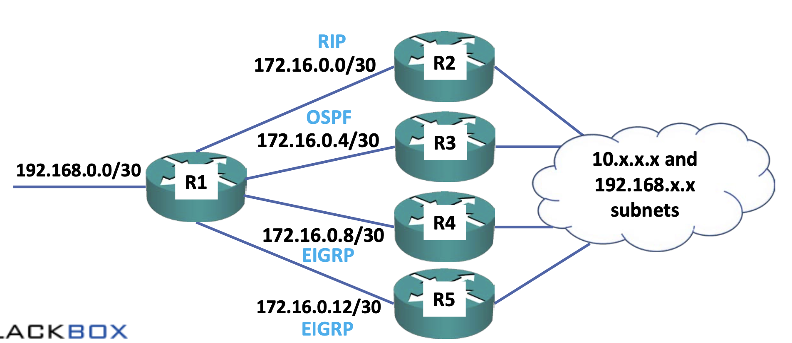

# Route Precedence

라우터는 관리자가 인터페이스에서 IP주소를 설정하면 연결된 경로와 로컬 경로를 학습하거나 관리자가 해당 라우터에 정적 경로를 설정한 것을 학습하거나 이웃 라우터로부터 라우팅 프로토콜을 통해 경로를 수신하여 학습한다.

패킷을 전달해야 할 때 어떤 경로를 사용할 지 어떻게 결정할까? 라우터의 주요 역할은 수신된 패킷을 목적지로 전달하는 것이며 학습된 경로를 기반으로 패킷을 전달할 위치를 결정한다. 

패킷에 대한 최상의 경로 결정은 **가장 긴 접두사, 즉 가장 구체적인 경로**를 기반으로 한다. 그 다음으로는 **관리 거리(AD)와 메트릭**을 기준으로 한다. 라우터가 정확히 동일한 네트워크와 접두사에 대해 여러 경로를 학습하는 경우 그 중에서 최적의 경로를 결정해야 한다. 예를들어 **R2로부터 EIGRP를 통해 192.168.0.0/24에 대한 경로를 수신**하고 **동일한 네트워크와 접두사 192.168.0.0/24에 대해 R3로부터 OSPF를 통해 다른 경로를 수신한 경우 이 두 경로 중에서 최적의 경로를 결정**해야 한다.

따라서 학습된 동일한 네트워크와 접두사에 대한 최적의 경로만이 라우팅 테이블에 들어가고 패킷을 전달하는 데 사용된다. 최적의 경로를 결정하는 데 사용되는 기준은 우선 관리거리이다. 관리거리는 값이 낮을수록, 즉 숫자가 낮을수록 좋다. 만약 관리거리가 동일하다면 메트릭(비용)을 사용한다. 메트릭에서도 값이 낮을수록 더 좋다. 동일한 관리거리와 메트릭을 가진 여러 최적의 경로가 있을 경우 이 모든 경로가 라우팅 테이블에 들어가고 라우터는 이러한 서로 다른 경로에 대해 동등한 비용 부하 분산을 수행한다.
## Route Precedence Example Topology

위의 예시에서 우리는 R1을 항상 거치고 R2, R3, R4, R5를 통해 목적지로 가는 경로를 학습할 것이다. 그래서 이 첫 번째 예제에서 R1은 이러한 경로를 학습한다.

- R2로부터 AD가 120인 RIP를 통해 10.0.0.0/24로 가는 경로를 학습한다. 메트릭은 5이다.
- R3로부터 AD가 110인 OSPF를 통해 10.0.0.0/24로 가는 경로를 학습한다. 메트릭은 2이다.
- R4로부터 AD가 90인 EIGRP를 통해 10.0.0.0/24로 가는 경로를 학습한다. 메트릭은 3072이다.
- R5로부터 AD가 90인 EIGRP를 통해 10.0.0.0/24로 가는 경로를 학습한다. 메트릭은 6144이다.

이렇다면 어떤 것이 가장 좋을까? 처음으로 확인해야 하는 것은 관리거리이다. 관리거리는 낮을수록 좋다. EIGRP에서 학습한 두 개의 경로는 관리거리 90을 가지고있고, RIP에서 배운 경로는 120이고 OSPF에서 배운 경로는 110이다. 또한 우리가 해당 네트워크로 가는 경로를 학습한 가장 낮은 관리거리는 EIGRP이며 90이다. 따라서 RIP와 OSPF를 통해 학습된 경로는 제외할 수 있다.

이제 R4에서 온 경로를 선택할 지 R5에서 온 경로를 선택할 지 결정해야한다. 동일한 목적지로 가는 여러 경로를 학습하고 동일한 관리거리를 갖는 경우 타이브레이커는 메트릭이며 다시 한 번 낮은 숫자가 더 좋다. 이 때, R4에서 온 경로의 메트릭은 3072이고, R5에서 온 경로의 메트릭은 6144이다. 따라서 R4에서 온 경로가 최적의 경로이며 이 경로가 라우팅 테이블에 포함될 것이다.
 
또 다른 예시로는 위와 비슷하지만 약간 다르다.

- R2로부터 AD가 120인 RIP를 통해 10.0.1.0/24로 가는 경로를 학습한다. 메트릭은 5이다.
- R3로부터 AD가 110인 OSPF를 통해 10.0.1.0/24로 가는 경로를 학습한다. 메트릭은 2이다.
- R4로부터 AD가 90인 EIGRP를 통해 10.0.1.0/24로 가는 경로를 학습한다. 메트릭은 3072이다.
- R5로부터 AD가 90인 EIGRP를 통해 10.0.1.0/24로 가는 경로를 학습한다. 메트릭은 3072이다.

예시를 보면 EIGRP를 통해 학습된 경로가 가장 좋은 관리거리를 가지고 있다. 또한 두 경로 모두 정확히 동일한 메트릭을 가지고 있다. 따라서 이 둘은 라우팅 테이블에 모두 들어가고, R1은 이 둘을 통해 트래픽을 부하 분산할 것이다.

또 다른 예시는 다음과 같다.

- 192.168.0.0/30은 연결된 경로이므로 인터페이스 G0/4에서 관리거리가 0이다.
- R2로부터 AD가 120인 RIP를 통해 192.168.0.0/24로 가는 경로를 학습한다. 메트릭은 1이다.
- R3로부터 AD가 110인 OSPF를 통해 192.168.0.0/16로 가는 경로를 학습한다. 메트릭은 11이다.
- R4로부터 AD가 90인 EIGRP를 통해 192.168.0.0/26로 가는 경로를 학습한다. 메트릭은 3072이다.
- R5로부터 AD가 90인 EIGRP를 통해 192.168.0.0/28로 가는 경로를 학습한다. 메트릭은 3072이다.

이들은 모두 다르다. 이들은 192.168.0.0이라는 동일한 네트워크로 가고 있지만 모두 다른 접두사를 가지고 있다. 정확히 동일한 네트워크와 접두사일 때만 동일한 것이라고 판단한다. 둘 중 하나라도 다르면 서로 다른 목적지로 판단한다. 따라서 sh ip route 명령어를 치면 이들이 모두 라우팅 테이블에 들어가는 것을 볼 수 있을 것이다.

만약 목적지가 겹치면 어떤 경로를 선택할까? 가장 구체적인 경로, 즉 가장 긴 접두사를 가진 경로를 선택한다. 목적지가 192.168.0.1 이라면 모든 경로에 걸치므로 가장 긴 접두사를 가진 경로인 192.168.0.0/30을 선택한다는 것이다.
