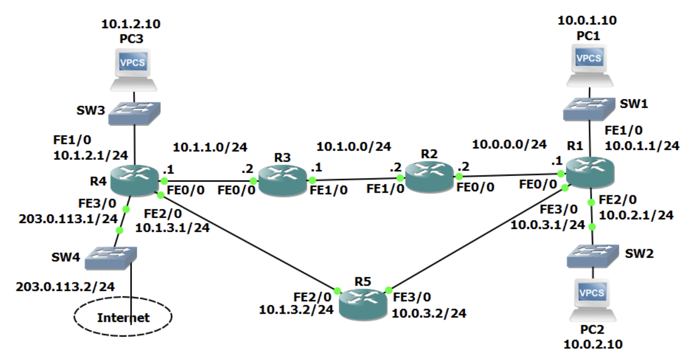

# Basic Connectivity Troubleshooting
## Ping

- Ping은 TCP, UDP, IP 등과 유사한 ICMP를 이용한다.
- 또한 TCP/IP 스위트의 일부이기도 하다.
- ICMP는 인터넷 제어 메시지 프로토콜의 약자로 연결성 테스트 용도로 사용된다.
- 핑은 **양방향 연결성**을 확인한다.
	- 출발지에서 목적지에 도달할 수 있는지와 목적지에서 다시 출발지로 회신이 도달 가능한지의 여부를 검증한다.
	- 만약 Cisco 라우터 상에서 핑이 성공적인 경우에는 느낌표가 표시된다.
	- 첫 핑이 실패하는 일은 흔하게 일어나는데, 이는 왜냐하면 라우터가 ARP 캐시를 업데이트 중일때 핑을 보냈기 때문이다.
	- 하지만 느낌표가 아닌 다섯 개의 마침표가 보인다면 핑에 실패한 것이다.
	- 또한 아주 드물게 다섯 개의 U 표시도 나오는데, 이는 도달 불가능하다 라는 의미이다. 라우터가 패킷을 폐기할 때 이런 경우가 발생할 수 있다. 예를들어 접근제어목록(ACL)에 의해 막히는 경우이다.
## Extended Ping

이 시나리오에서는 우측 상단에 있는 PC1의 유저가 PC3에 접근할 수 없다고 항의를 하고 있다. 그래서 우리는 점검을 위해 R1으로 이동해 10.1.2.10에 있는 PC3에 핑을 보낸다. 문제의 실제 원인은 R4가 10.0.1.10에 있는 PC1로 돌아갈 경로가 존재하지 않다는 것이다. 하지만 지금 시나리오에서는 10.0.0.1의 R1으로 돌아갈 수 있는 경로가 있다.

라우터에서 핑을 보낼 때 라우터 자체에서 출발하는 모든 트래픽을 보낼 때에는 발신 인터페이스를 출발지 IP주소로 사용한다. 만약 R1에서 10.1.2.10으로 핑을 보내면 이 핑은 10.0.0.1을 출발지 IP주소로 사용할 것이다. 그 주소가 발신 인터페이스의 IP 주소이기 때문이다. 오른쪽에서 왼쪽으로 향하는 연결이 되어 있는 한 이 핑은 PC3로 도달을 할 것이고 PC3는 회신을 보낼 것이다, R4에서 10.0.0.0 네트워크로 가는 경로가 있기 때문에 핑은 성공할 것이다.

하지만 유저는 핑이 닿지 않는다고 호소하고 있다. 이런 경우에는 PC1과 동일한 서브넷에서 핑을 보내야 한다. PC1 자체에서 핑을 보내야 하는데, 만약 PC1에 접근할 수 없는 상황이라면 R1으로부터 핑을 보내되 유저와 동일한 서브넷인 출발지 주소인 10.0.1.1에서 핑을 보내야 하는 것이다. 이럴 때 확장 핑을 사용하게 된다.

결과적으로 PC1에서 핑을 보내면 타임아웃이 뜨게되어 핑이 실패하게 되고, R1에서 핑을 보내면 성공하는데 그 이유는 R4에 돌아올 경로가 있는 출구 인터페이스의 IP 주소로부터 오는 것이기 때문이다.

유저가 연결성 문제로 항의를 해서 라우터에서 핑을 보내야 하는 경우에 이를 확인하기 위해서는 동일한 서브넷에 있는 출발지 주소로부터 핑을 보내봐야 한다.(실무에서도 마찬가지) 확장된 핑을 보내기 위해서는 명령어 ping을 입력 후, 그냥 Enter를 누르면된다. 그러면 핑에 설정할 옵션을 물어볼 것이다.
## Traceroute

- Traceroute는 핑과 마찬가지로 연결성 점검을 위해서 사용된다.
- Traceroute의 역할은 트래픽이 네트워크를 타고 움직일 때의 **경로를 추적**하는 것이다.
- Traceroute와 일반적인 Ping의 차이점은 Traceroute는 IP 헤더에 있는 TTL 필드를 이용한다.
	- TTL은 경로 루프 방지 메커니즘으로 사용된다.
	- 라우터가 패킷을 하나의 인터페이스로부터 다른 인터페이스로 전달할 때마다 TTL이 1씩 감소한다.
	- 만약 TTL이 15인 패킷을 R1이 R2에게 보낸다면, R2에 도달하면 TTL이 1 감소하여 14가 되고 R1으로 되돌아온다. 그리고 R1에서 13으로 감소하여 R2로 다시 보내질 것이다. 끝내는 R2, 혹은 R1 어디에서 끝나느냐에 상관없이 TTL 0이 되는 순간 패킷을 폐기된다.
	- 패킷이 폐기될 때 발신자에게 시간 초과라는 메시지를 보내 TTL의 초과로 인해 패킷이 폐기되었다는 사실을 알린다.
- Traceroute는 일반 Ping처럼 작동하지만 첫 핑을 보낼 때 TTL을 1로 설정해 보낸다. 이렇게 하면 Ping이 첫 홉에 도착한 후 폐기되어 시간 초과 회신을 보내게 된다.
	- 이렇게 되면 첫 홉에 대한 정보를 알 수 있게 된다. Traceroute를 R1에서 했다면 첫 홉인 R2에 도달하여 TTL이 0이 되고 다시 R1에 도달하였을 때 timeout이 발생하기 때문에 첫 홉은 R2인 것을 확인할 수 있다.
- 그 후 R1은 패킷을 하나 더 보낸다. 이 때는 TTL을 2로 설정한다. 그럼 패킷이 두 번째 홉(R3)에 도달할 수 있을 것이다. 만약 두 번째 홉이 목적지라면 목적지에 도달하였으므로 R3는 echo reply 를 보내게 되고 Traceroute는 완료된다.
- 만약 목적지까지의 거리가 10개의 홉이라면 첫 패킷에 TTL 1, 2, 3 이렇게 늘려 갈 것이다. 이렇게 함으로써 트래픽이 목적지까지 가는 데 거치는 경로를 홉 단계별로 파악할 수 있게 된다.
- 혹시 Ping은 성공인데, Traceroute는 실패하더라도 트래픽은 작동 중이니 걱정 안해도 된다. 가끔씩 마지막 홉에서 Traceroute가 실패하기도 한다. 또한 방화벽에 의해 Traceroute 트래픽이 폐기되기도 한다.
- 만약 Traceroute가 진행하다가 예를들어 10.1.0.1 까지의 경로에서 멈췄다면 10.1.0.1에 있는 라우터에 문제가 생겼을 가능성이 매우 높다.
#### Other Tools - Layer 1

- show ip interface brief
- show interface
#### Other Tools - Layer 2

- show arp
- show mac address-table
#### Other Tools - Layer 4

- Telnet
#### Other Tools - DNS

- nslookup
- Ping by FQDN
